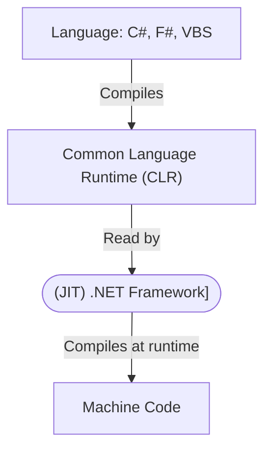

# .NET Framework

> [.NET Framework vs .NET Core vs .NET vs .NET Standard vs C#](https://www.youtube.com/watch?v=4olO9UjRiww)

.NET is a platform you build upon, you can use it in `C#`, `VBS` and `F#`. You can use whichever language that implements it.

When you compile a C# application, it gets converted to a Common Language Runtime, then, the Just In Time (JIT) compiler converts it to machine code _(that's .NET!)_.

## Versions

C# is OOP, and F# is a functional programming, those are very different styles of programming, but because they both get compiled to the same CIL, you can call F# from C# and viceversa.

The .NET framework is 20 years old, and has had a lot of changes to make it better, but it still is backwards compatible, so it became slower and slower and more bloated. But this problem was changed with the invention of .NET Core.

.NET Core is an update for the .NET framework to make it faster and less bloated, but loses the backward compatibility. So then, the .NET Framework gets replaced by .NET Core.

> Note: The .NET Framework is still being supported.

The .NET Core was named just **.NET** after the 4.0 version, and the new versions are name **.NET X**, where X is the new version.

.NET Standard is essentially an interface, or a bridge, for .NET (.NET Core), .NET Framework, Unity and other C# libraries, so that it can be written once and called by different .NET versions.
